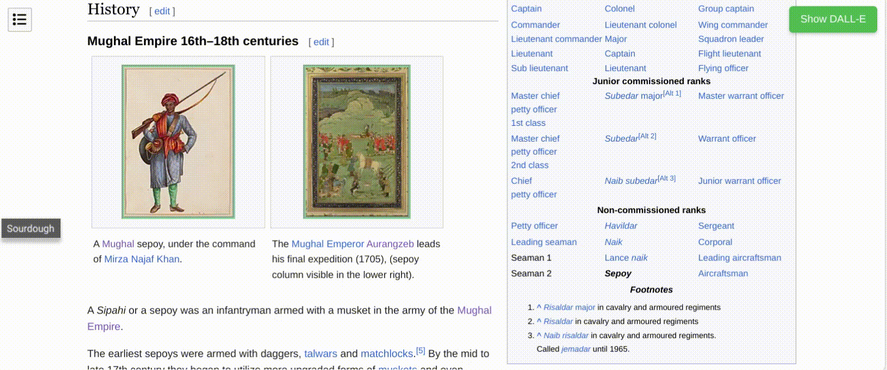

# Dallepedia Chrome Extension

Dallepedia enhances Wikipedia articles by automatically generating modern versions of images using ChatGPT and DALL-E. This process is efficient and user-friendly, as all generated images are saved to a database, ensuring that images only need to be generated once by any user.

The extension allows users to toggle between the original Wikipedia images and their DALL-E generated counterparts, providing a fresh perspective on articles with outdated illustrations or artwork.

[Built entirely with Code-Bi-Wan ChatGPT](https://chat.openai.com/g/g-ZdiOhxKwp-code-bi-wan)

Video below

## Features

- **Dynamic Image Toggle**: Seamlessly switch between original and DALL-E generated images within Wikipedia articles.
- **Global Image Toggle**: A dedicated button allows for simultaneous toggling of all images on a page between their original and DALL-E versions.
- **Database Efficiency**: Generated images are stored in a database, enabling quick retrieval for future visits and minimizing API usage.
- **Smart Image Selection**: The extension processes only those images that are visible and meet specific size criteria, ensuring relevance and efficiency.
- **Hover to Preview**: Users can hover over images to preview the alternative version without toggling.
- **Extension Customization**: Users can adjust settings, including enabling or disabling hover preview, via the extension's options menu.

## Installation

1. Clone the repository or download the code.
2. Open Chrome and navigate to `chrome://extensions/`.
3. Enable Developer Mode.
4. Drag and drop Dallepedia.crx onto the screen

## Usage

- After installation, visit any Wikipedia page to see the extension in action.
- Images eligible for DALL-E processing will show a distinct border. Hover over these images to preview the DALL-E version (if hover preview is enabled).
- Click on individual images or use the global toggle button located at the top right of the page to switch between original and DALL-E versions.
- Access extension settings to customize features, including disabling the hover preview or the entire DALL-E image generation.

## Image Storage and Retrieval

- When an image is processed for the first time, the DALL-E generated version is saved to a database.
- For subsequent visits to the same page by any user, the extension retrieves the pre-generated image from the database, ensuring efficient use of resources and faster load times.

## Configuration

- **API Key**: Set your OpenAI API key in the extension's popup menu to enable DALL-E image generation.
- **Enable/Disable**: The extension can be easily enabled or disabled from the popup menu.

## Contributing

Contributions are welcome. Please fork the repository and submit a pull request with your changes.

## License

[MIT License](LICENSE)

## Acknowledgments

- DALL-E for the AI-generated images.
- Wikipedia for the vast source of knowledge and imagery.

## Disclaimer

This extension is not affiliated with Wikipedia or OpenAI. It is a community-driven project for educational purposes.
