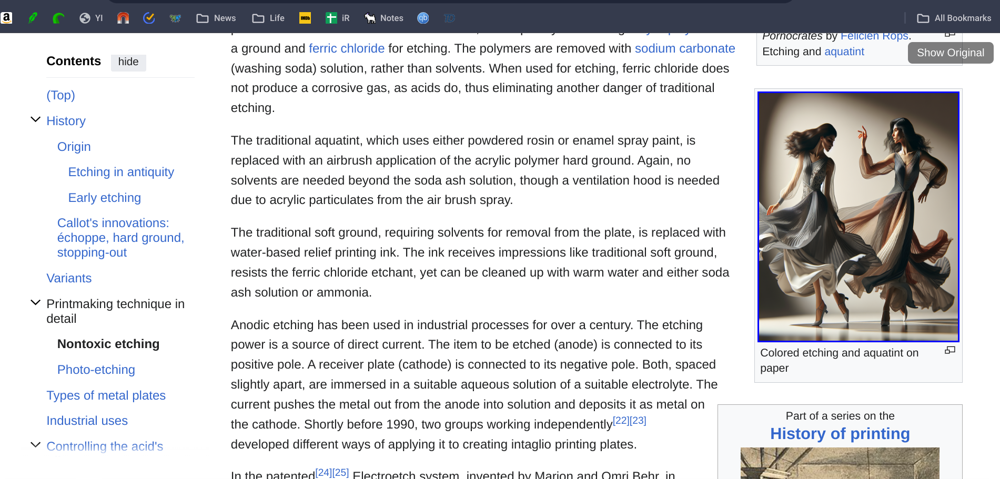

# Dallepedia Chrome Extension

Dallepedia automatically creates modern versions of Wikipedia article images via ChatGPT and DALL-E. All generations are saved to a database and only need to be generated by any user once. 

The extension will take each article image and generate a DALLE prompt and image and allow you to toggle between the original images and DALL-E images. Best used on articles with old illustrations or art. 

[Built entirely with Code-Bi-Wan ChatGPT](https://chat.openai.com/g/g-ZdiOhxKwp-code-bi-wan)

Click here for a quick video demo.

## Features

- **Image Toggle**: Users can switch between the original Wikipedia image and a DALL-E generated version.
- **Global Toggle**: A single button to toggle all images on the page between original and DALL-E versions.
- **Efficient Image Processing**: Images generated by DALL-E are saved to a database. When a new user visits the same Wikipedia page, the extension automatically retrieves the already generated images, reducing redundant processing and API calls.
- **Selective Processing**: Only processes images that are visible and meet size criteria.
- **Customizable**: Extension settings can be adjusted via a popup menu.

## Installation

1. Clone the repository or download the code.
2. Open Chrome and navigate to `chrome://extensions/`.
3. Enable Developer Mode.
4. Drag and drop Dallepedia.crx onto the screen

## Usage

- Once installed, navigate to any Wikipedia page.
- Images that are processed by the extension will have a colored border indicating they can be toggled. 
- Images being processed will have a loading indicator.
- Click the 'Show DALL-E' or 'Show Original' button to toggle images individually.
- Use the global toggle button at the top right corner of the page to switch all images at once.
- To disable DALL-E image generation, use the extension's popup menu.

## Image Storage and Retrieval

- When an image is processed for the first time, the DALL-E generated version is saved to a database.
- For subsequent visits to the same page by any user, the extension retrieves the pre-generated image from the database, ensuring efficient use of resources and faster load times.

## Configuration

- **API Key**: Set your OpenAI API key in the extension's popup menu to enable DALL-E image generation.
- **Enable/Disable**: The extension can be easily enabled or disabled from the popup menu.

## Contributing

Contributions are welcome. Please fork the repository and submit a pull request with your changes.

## License

[MIT License](LICENSE)

## Acknowledgments

- DALL-E for the AI-generated images.
- Wikipedia for the vast source of knowledge and imagery.

## Disclaimer

This extension is not affiliated with Wikipedia or OpenAI. It is a community-driven project for educational purposes.
